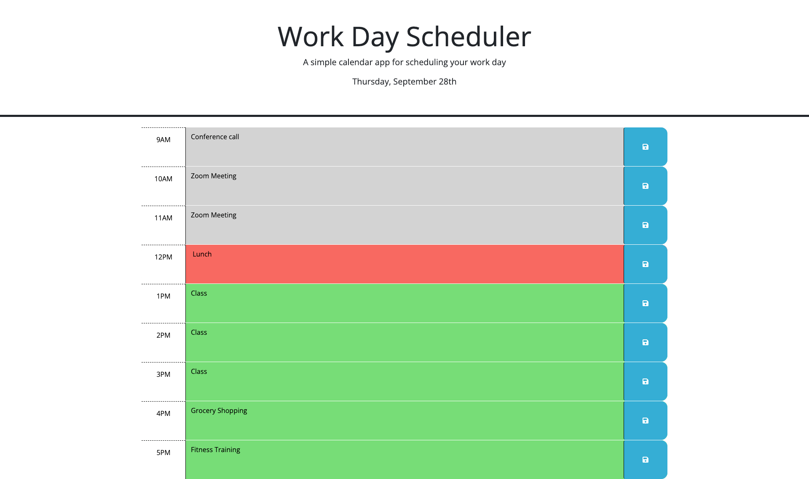

# Work Day Scheduler

## Description

The Work Day Scheduler is a simple application that allows end users to save events for each hour of a typical working day (9am–5pm). This app will run in the browser and feature dynamically updated HTML and CSS powered by jQuery.

- This motivation for this project is to provide users with an a tool organize daily activities.
- Scheduling organizes planned activities, while promoting work day predictability and visibility.
- Users of this application will experience improved time management and increased productivity.
- Lesson: Scheduling sets time frames for execution.

## Table of Contents

- [Usage](#usage)
- [Credits](#credits)
- [License](#license)

## Usage

1. Go to your browser.
2. Visit the address listed below.
3. Select a time from 9:00am - 5:00pm.
4. Enter a scheduled activity.
5. Click the icon to save.
6. Refresh page.
7. Notice that activity items are stored locally.

Site: 

## Credits

https://www.markdownguide.org/cheat-sheet/

https://gist.github.com/lukas-h/2a5d00690736b4c3a7ba

https://coding-boot-camp.github.io/full-stack/github/professional-readme-guide

## MIT License

Copyright (c) 2023 G6-2Flyy

Permission is hereby granted, free of charge, to any person obtaining a copy of this software and associated documentation files (the "Software"), to deal in the Software without restriction, including without limitation the rights to use, copy, modify, merge, publish, distribute, sublicense, and/or sell copies of the Software, and to permit persons to whom the Software is furnished to do so, subject to the following conditions:

The above copyright notice and this permission notice shall be included in all copies or substantial portions of the Software.

THE SOFTWARE IS PROVIDED "AS IS", WITHOUT WARRANTY OF ANY KIND, EXPRESS OR IMPLIED, INCLUDING BUT NOT LIMITED TO THE WARRANTIES OF MERCHANTABILITY, FITNESS FOR A PARTICULAR PURPOSE AND NONINFRINGEMENT. IN NO EVENT SHALL THE AUTHORS OR COPYRIGHT HOLDERS BE LIABLE FOR ANY CLAIM, DAMAGES OR OTHER LIABILITY, WHETHER IN AN ACTION OF CONTRACT, TORT OR OTHERWISE, ARISING FROM, OUT OF OR IN CONNECTION WITH THE SOFTWARE OR THE USE OR OTHER DEALINGS IN THE SOFTWARE.

---

## Features

- HTML/CSS/DayJS/jQuery
- URL/Web address
- GUI
- Local storage

